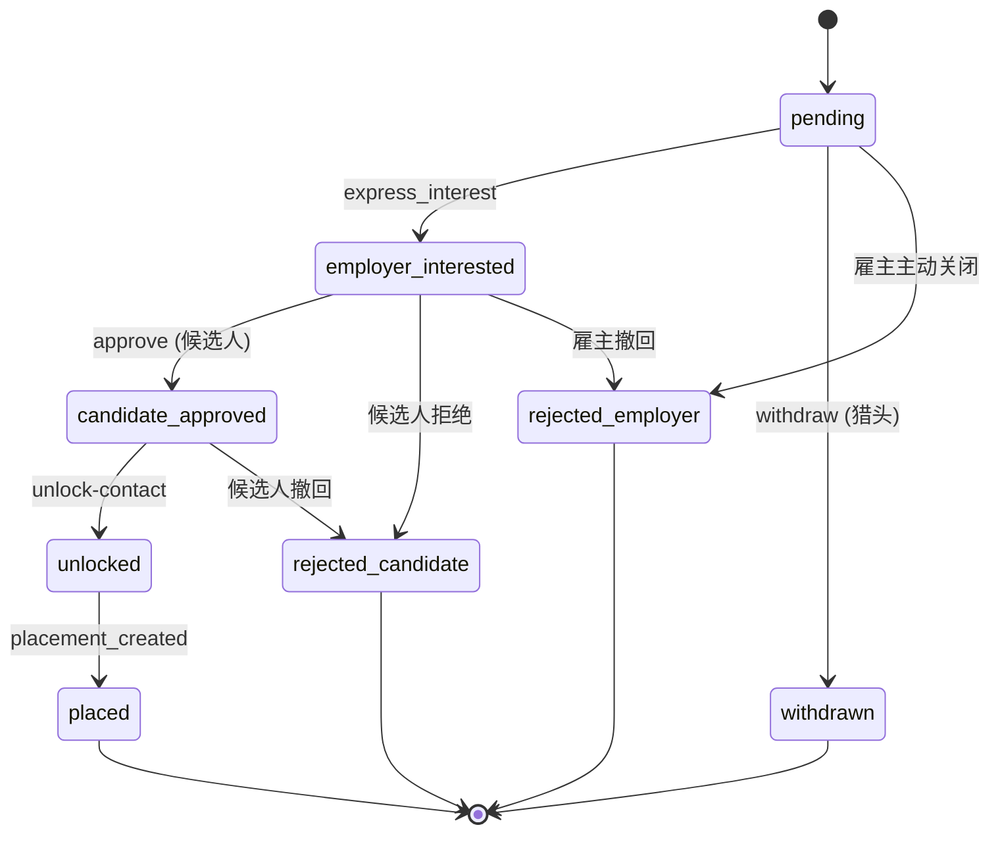

# skill.md Hardening Implementation Plan

> **For agentic workers:** REQUIRED SUB-SKILL: Use superpowers:subagent-driven-development (recommended) or superpowers:executing-plans to implement this plan task-by-task. Steps use checkbox (`- [ ]`) syntax for tracking.

**Goal:** Repair correctness/consistency gaps in `docs/superpowers/skill.md`, complete the R1-era documentation that has been missing since 2026-07-11, and add programmatic guardrails so the doc cannot drift again. Deliver as one PR.

**Architecture:** Mostly doc edits in a single file (`docs/superpowers/skill.md`) read by Agent clients via `GET /v1/skill.md`. Four small code changes: ① resolve the broken `/v1/capabilities/by-alias` promise in §2.1.0.1, ② add a CHANGELOG→skill.md sync script (`pnpm skill:changelog`), ③ generate a navigation TOC, ④ add an `agent-quickstart.ts` sample under `examples/`. The server already serves the file verbatim (`server.ts:191`), so file edits + one script invocation cover the runtime surface.

**Tech Stack:** Markdown, mermaid (rendered by GitHub/VSCode/ZCode), bash, TypeScript, vitest. No DB schema change.

**Reference spec:** Informal — derive from the audit summary in `docs/PROJECT_MEMORY.md` §3, `CHANGELOG.md` (R1 era entries), `src/main/server.ts` lines 220–270 (route table), `src/main/capabilities/{auth,headhunter,employer,candidate,admin}.ts` and `src/main/capabilities/pm.ts` + `candidate-portal.ts` (real endpoint inventory), `src/main/seed/admin.ts` (real admin auth).

---

## File Structure

| File | Action | Responsibility |
|------|--------|----------------|
| `docs/superpowers/skill.md` | Modify (largest) | The agent-facing contract doc — 1669 lines → ≈ 2200 lines after P0/P1/P2/P3 |
| `README.md` | Modify | Sync §`.env required` env vars with new admin auth (remove `ADMIN_PASSWORD_HASH`, point to `SEED_ADMIN_PASSWORD`) |
| `src/main/capabilities/index.ts` | Modify | Add `getAliasEndpoint(name)` helper that finds an alias's canonical HTTP endpoint; export from existing barrel |
| `src/main/routes/capabilities.ts` | Modify | Add `GET /v1/capabilities/by-alias/:name` public endpoint that returns `{ canonical, method, path }` or 404 — fulfills the promise in current §2.1.0.1 |
| `tests/integration/capabilities-by-alias.test.ts` | Create | Integration test for the new endpoint (3 bindings from R1.C4) |
| `scripts/sync-skill-md-changelog.ts` | Create | Reads top of `CHANGELOG.md`, injects into `## 📝 最近升级` section of skill.md, idempotent. New `pnpm skill:changelog` script |
| `examples/agent-quickstart.ts` | Create | ~150-line runnable end-to-end sample that mirrors §11 (Python) in TypeScript |
| `tests/integration/examples-agent-quickstart.test.ts` | Create | Smoke test that runs `examples/agent-quickstart.ts` against an ephemeral DB |
| `docs/superpowers/skill.md` (TOC) | Modify | Add `## 📑 目录` section near top (auto-anchored links to each `##` heading) |
| `docs/CHANGELOG.md` | Modify | Add entry under `[Unreleased] — 2026-07-15` for the doc hardening pass |

Existing tests that lint/conformance-check the doc:
- `tests/integration/skill-md-conformance/` — already exists; `pnpm conformance:check` will catch §16 generated sections drifting.
- `tests/unit/schema-coverage.test.ts` — not affected.
- `vitest.config.ts` — picks up new tests automatically.

---

## Phase 1 — P0: correctness & consistency (must ship)

### Task 1: Branch off main

**Files:** none

- [ ] **Step 1: Confirm clean tree**

Run:
```bash
git -C D:/dev/hunter-platform status --short
git -C D:/dev/hunter-platform branch --show-current
```
Expected: empty status output; branch = `main`.

- [ ] **Step 2: Create working branch**

Run:
```bash
git -C D:/dev/hunter-platform checkout -b docs/skill-md-hardening
```

- [ ] **Step 3: Commit (no-op yet)**

No commit needed yet — proceed to Task 2.

---

### Task 2: P0-1 — Add `/v1/pm/*`, `/v1/candidate-portal/*`, `/v1/headhunter-workspace/*`, `/v1/employer-panel/*` to skill.md §2

**Files:**
- Modify: `docs/superpowers/skill.md` (insert after line 296 — current end of §2.1 — three new sub-sections 2.2a / 2.4a / 2.3a plus mount summary)

- [ ] **Step 1: Build endpoint table from real routes**

Read each file and copy route definitions verbatim into the doc — DO NOT paraphrase:

- `src/main/routes/pm.ts` → 25 endpoints (all prefixed with `/v1/pm`)
- `src/main/routes/candidate-portal.ts` → 15 endpoints (`/v1/candidate-portal`)
- `src/main/routes/headhunter-workspace.ts` → 15 endpoints (`/v1/headhunter-workspace`)
- `src/main/routes/employer-panel.ts` → start with `/v1/employer-panel/dashboard`, expand later

Use the same table shape as existing §2.2–§2.4:

```markdown
### 2.2a 雇主（pm canonical，R1+）

> R1 起新增的 pm 主路由。`/v1/employer/*` 仍是兼容旧客户端的别名，pm 角色同时挂在三处（`pm` / `employer` / `employer-panel`），新代码优先用 `/v1/pm/*`。

| Method | Path | 描述 | 配额 |
|--------|------|------|------|
| POST | `/v1/pm/projects` | 创建招聘项目 | 5 |
| GET  | `/v1/pm/projects` | 列出我的招聘项目 | 1 |
...
```

- [ ] **Step 2: Verify pointer consistency**

After insertion, run:
```bash
grep -c "/v1/pm/" D:/dev/hunter-platform/docs/superpowers/skill.md       # ≥ 25
grep -c "/v1/candidate-portal/" D:/dev/hunter-platform/docs/superpowers/skill.md  # ≥ 15
grep -c "/v1/headhunter-workspace/" D:/dev/hunter-platform/docs/superpowers/skill.md  # ≥ 15
```

- [ ] **Step 3: No commit yet** — batch with the next tasks until Task 5 (one P0 commit per logical group).

---

### Task 3: P0-3 — Implement `GET /v1/capabilities/by-alias/:name`

This fulfils the broken promise at skill.md:293 (`未来 /v1/capabilities/by-alias`).

**Files:**
- Modify: `src/main/capabilities/index.ts` (add `getAliasEndpoint(name)` helper)
- Modify: `src/main/routes/capabilities.ts` (add the route)
- Create: `tests/integration/capabilities-by-alias.test.ts`

- [ ] **Step 1: Write failing integration test**

Create `tests/integration/capabilities-by-alias.test.ts`:

```typescript
import { describe, it, expect, beforeAll, afterAll } from 'vitest';
import fs from 'node:fs';
import path from 'node:path';
import supertest from 'supertest';
import { openDb } from '../../src/main/db/connection';
import { runMigrations } from '../../src/main/db/migrations';
import { createServer } from '../../src/main/server';
import type { Server } from 'node:http';

const tmpDb = path.join(__dirname, '../../tmp/cap-by-alias.db');
let server: Server;

beforeAll(async () => {
  if (fs.existsSync(tmpDb)) fs.unlinkSync(tmpDb);
  const db = openDb(tmpDb);
  runMigrations(db);
  server = createServer(db, { NODE_ENV: 'test', PORT: 0 } as any).listen(0);
});
afterAll(() => {
  server.close();
  fs.unlinkSync(tmpDb);
});

describe('GET /v1/capabilities/by-alias/:name', () => {
  it('maps ow_recruit.advance_candidate to pm.select_staffing_plan', async () => {
    const res = await supertest(server)
      .get('/v1/capabilities/by-alias/ow_recruit.advance_candidate')
      .expect(200);
    expect(res.body.data.canonical).toBe('pm.select_staffing_plan');
    expect(res.body.data.method).toBe('POST');
    expect(res.body.data.path).toBe('/v1/pm/staffing-plans/:id/select');
  });

  it('returns 404 for unknown alias', async () => {
    await supertest(server)
      .get('/v1/capabilities/by-alias/nope.nope')
      .expect(404);
  });

  it('does NOT require auth', async () => {
    // No Authorization header; no X-Active-Role. Same as /v1/capabilities.
    const res = await supertest(server)
      .get('/v1/capabilities/by-alias/ow_recruit.send_message')
      .expect(200);
    expect(res.body.ok).toBe(true);
  });
});
```

- [ ] **Step 2: Run to verify it fails**

Run: `cd D:/dev/hunter-platform && pnpm vitest run tests/integration/capabilities-by-alias.test.ts 2>&1 | tail -40`
Expected: FAIL — `404 / route not found`.

- [ ] **Step 3: Implement the helper**

In `src/main/capabilities/index.ts` add:

```typescript
import { ALL_CAPABILITIES } from './types';  // adjust to existing import

export interface CapabilityAlias {
  readonly canonical: string;
  readonly method: string;
  readonly path: string;
}

export function getCapabilityEndpointByAlias(alias: string): CapabilityAlias | undefined {
  for (const cap of ALL_CAPABILITIES) {
    const aliases = cap.aliases ?? [];
    if (aliases.includes(alias)) {
      return {
        canonical: cap.name,
        method: cap.method,
        path: cap.path,
      };
    }
  }
  return undefined;
}
```

(Adjust the constant name / shape to whatever `src/main/capabilities/types.ts` currently exposes — see line 23 there. The intent: scan all declared capabilities for `aliases[]` field that includes the lookup name.)

- [ ] **Step 4: Wire the route**

In `src/main/routes/capabilities.ts`, add a new route BEFORE the existing catch-all:

```typescript
import { getCapabilityEndpointByAlias } from '../capabilities';

// Inside createCapabilitiesRouter(db):
router.get('/by-alias/:name', (req, res) => {
  const result = getCapabilityEndpointByAlias(req.params.name);
  if (!result) {
    return res.status(404).json({
      ok: false,
      error: { code: 'NOT_FOUND', message: `No capability alias '${req.params.name}'` },
    });
  }
  respond(res, AliasResponseSchema, { ok: true, data: result });
});
```

Define `AliasResponseSchema` in `src/main/schemas/capabilities.ts`:

```typescript
export const AliasResponseSchema = EnvelopeSchema(z.object({
  canonical: z.string(),
  method: z.string(),
  path: z.string(),
}));
```

- [ ] **Step 5: Re-run integration test**

Run: `pnpm vitest run tests/integration/capabilities-by-alias.test.ts`
Expected: 3/3 PASS.

- [ ] **Step 6: Run schema-coverage**

Run: `pnpm test:schemas`
Expected: PASS (no new violations).

- [ ] **Step 7: Commit**

```bash
git -C D:/dev/hunter-platform add tests/integration/capabilities-by-alias.test.ts \
  src/main/capabilities/index.ts \
  src/main/routes/capabilities.ts \
  src/main/schemas/capabilities.ts
git -C D:/dev/hunter-platform commit -m "feat(capabilities): add GET /v1/capabilities/by-alias/:name (resolves R1.C4 promise)"
```

---

### Task 4: P0-2 — Replace `ADMIN_PASSWORD_HASH` references with new admin auth flow

**Files:**
- Modify: `docs/superpowers/skill.md` §F (env var table around line 1634–1646) and §X (admin section line 717–720)
- Modify: `README.md` (env var bullet around line 41–45)

- [ ] **Step 1: Update skill.md §F table**

Replace the `ADMIN_PASSWORD_HASH` row with:

```markdown
| `ADMIN_PASSWORD_HASH` | ❌ | — | **已废弃（v1.5）** — 改用 `SEED_ADMIN_PASSWORD` 启动 seed + `POST /v1/admin/auth/login` |
| `SEED_ADMIN_PASSWORD` | ⚠️ 仅首次部署 | — | 第一次 deploy 时设置，自动 seed `admin@qing3.top`，之后改 `POST /v1/admin/auth/login` 走 per-admin bcrypt |
| `SEED_ADMIN_EMAIL`    | ❌ | `admin@qing3.top` | 首次 seed admin 的 email |
| `ADMIN_PASSWORD_FILE`  | ❌ | `/opt/hunter-platform/.admin-password` | 备用：从此文件读首次 seed 密码（生产推荐） |
```

- [ ] **Step 2: Update skill.md §X admin intro**

Replace the 4-line intro block at the top of §X (lines 716–720) with:

```markdown
> **鉴权（v1.5+，per-admin api_key）**：
> 1. 首次部署设置 `SEED_ADMIN_PASSWORD` → 启动时自动 seed `admin@qing3.top`
> 2. `POST /v1/admin/auth/login { email, password }` → `{ api_key: hp_adm_xxx }`（每次登录生成新 key，旧 key 立即失效）
> 3. 之后所有 admin 请求 `Authorization: Bearer hp_adm_xxx`
> 4. 旧的 `ADMIN_PASSWORD_HASH` env var 已废弃，新代码完全不读。
```

- [ ] **Step 3: Update README.md**

Replace the `ADMIN_PASSWORD_HASH` bullet with:

```markdown
- `SEED_ADMIN_PASSWORD`（首次部署 seed 第一个 admin 用的密码，登录后 `POST /v1/admin/auth/login` 改）
- `WEBHOOK_HMAC_SECRET`（≥16 字符）
- 不再需要 `ADMIN_PASSWORD_HASH`（v1.5+ 已废弃）
```

- [ ] **Step 4: Verify no leftover references**

Run:
```bash
grep -rn "ADMIN_PASSWORD_HASH" D:/dev/hunter-platform/docs D:/dev/hunter-platform/README.md
```
Expected: NO matches in docs/README (only in legacy code comments / migration notes, which is intentional).

- [ ] **Step 5: Commit**

```bash
git -C D:/dev/hunter-platform add docs/superpowers/skill.md README.md
git -C D:/dev/hunter-platform commit -m "docs(skill): replace legacy ADMIN_PASSWORD_HASH with per-admin api_key flow"
```

---

### Task 5: P0-4 — Deduplicate webhook signing paragraph + remove aspirational v2 claims

**Files:**
- Modify: `docs/superpowers/skill.md` §6.2 around lines 681–696

- [ ] **Step 1: Edit §6.2 to remove duplicate block**

The block at lines 681–696 has the signing paragraph repeated. Delete the first occurrence (the "⚠️ v1 设计缺口 + 平台用 WEBHOOK_HMAC_SECRET 做 HMAC-SHA256" block) and replace with a clean single statement:

```markdown
### 6.2 签名验证

平台用 `WEBHOOK_HMAC_SECRET`（`.env` 配置）做 HMAC-SHA256。**当前 secret 是平台全局共享**，无 per-user 派生机制（per-user 派生计划已在 v2 取消 — 见 `CHANGELOG.md`）：所有接收方用同一 secret 验证。

**Headers:**
- `X-Hunter-Signature: sha256=<hmac-hex>` — 完整小写 hex，可选 `sha256=` 前缀，接收方需剥离后比较
- `X-Hunter-Timestamp: <unix-seconds>` — 出站时的秒级时间戳
- `X-Hunter-Event: <event_type>` — 事件名，信息性

**签名数据**：`${timestamp}.${raw_body}`（注意 `.` 是字面量，非拼接模板）

**接收方必须**：
1. 验证时间戳（`|now - ts| < 300s`，防重放）
2. 用常量时间比较 hex 字符串（防时序攻击）
```

- [ ] **Step 2: Verify no duplicate marker**

Run:
```bash
grep -c "X-Hunter-Signature: sha256" D:/dev/hunter-platform/docs/superpowers/skill.md
```
Expected: `1` (not 2 like in current state).

- [ ] **Step 3: Commit** (defer — will be rolled up with P1 commits at end of Phase 2)

Track in TODO; final commit at end of Phase 2.

---

## Phase 2 — P1: R1-era accuracy & ow-recruit walkthrough (must ship)

### Task 6: P1-1 — Add "R1 era" summary section below existing "最近升级" intro

**Files:**
- Modify: `docs/superpowers/skill.md` — insert new section right after line 25 (end of existing "最近升级" block)

- [ ] **Step 1: Insert section**

```markdown
### 2026-07-15 — R1 era: Client-contract stabilization

四个相对独立的协议稳定化（**breaking**，Agent 接入前必读）：

- **R1.C2** — 长 session + 多角色认证
  - `POST /v1/auth/login` 拿 `sess_*`（168h 滑动 TTL）；`POST /v1/auth/refresh` 续期；`POST /v1/auth/logout` 撤销（idempotent）
  - 新用户注册即获三角色；`X-Active-Role: pm|hr|candidate` header 切换活跃角色
  - 旧 `hp_live_*` API key 仍可用（向后兼容），但新 agent 优先用 session
  - **BREAKING**: `user_type` enum 已重命名 `headhunter → hr`、`employer → pm`（迁移见 OPERATIONS.md §3.3）

- **R1.C3** — 入站 webhook 去重
  - 新端点 `POST /v1/webhooks/qing3`，HMAC 验证后 `INSERT OR IGNORE` 到 `webhook_inbox_deliveries`
  - 重放窗口 ±300s；body UNIQUE 去重（同 body 第二次返回同 `delivery_id`）
  - 见 §17 inbound webhook 部分

- **R1.C4** — Capability aliases（为 ow-recruit 桥接而设计）
  - `Capability.aliases?: readonly string[]` 字段；外部客户端可以用自己的命名
  - 服务端查表：`GET /v1/capabilities/by-alias/:name` → `{ canonical, method, path }`（见 §2.1.0.1）
  - 已绑三对：`ow_recruit.advance_candidate → pm.select_staffing_plan`、`ow_recruit.send_message → candidate_portal.messages.send`、`ow_recruit.sync_project_to_erp → pm.update_project`

- **T10** — `roleGate()` 闭包 RBAC
  - 中间件挂在 `/v1/pm`、`/v1/employer`、`/v1/employer-panel`（pm-gated），`/v1/headhunter`、`/v1/headhunter-workspace`（hr-gated），`/v1/candidate`（candidate-gated）
  - 同一个 user 用不同 `X-Active-Role` token 调不同 prefix 的路由会被 403 — 这是预期行为
  - 详见 §1.1.3 Active Role 约束
```

- [ ] **Step 2: Verify section heading anchor exists**

Run:
```bash
grep -n "^### 2026-07-15 — R1 era" D:/dev/hunter-platform/docs/superpowers/skill.md
```
Expected: prints a single line number (insertion successful).

- [ ] **Step 3: Roll into final P1 commit at end of Phase 2.**

---

### Task 7: P1-2 — Add `### 17. Hunter × ow-recruit Collab Mode`

**Files:**
- Modify: `docs/superpowers/skill.md` — append at end (before Appendix A)

- [ ] **Step 1: Insert section**

```markdown
## 🤝 17. Hunter × ow-recruit Collab Mode

ow-recruit（独立 relay，单 binary + SQLite + browser SPA）可选通过 webhook + capability aliases 与 hunter-platform 对接。本节描述完整 collab 流。

### 17.1 拓扑

```
ow-recruit relay (single binary, :8080)
   │
   │  ① HTTP POST /v1/skills/{name}  (Agent 进入)
   │  ───────────────────────────────────
   │  - impl='qing3' 模式下,runner 把 skill call forward 到本平台的对应 endpoint
   │  - 用 capability alias 解析 ow_recruit.* → 内部 canonical
   │
   │  ② POST /v1/webhooks/qing3   (异步事件回流)
   │  ────────────────────────────────
   │  X-Hunter-Signature: sha256=<hex>
   │  X-Hunter-Timestamp: <unix-seconds>
   │  X-Hunter-Event: <6 个事件类型之一>
   │  body: { type, payload, contains_pii }
   │
   ▼
hunter-platform (本平台, :3000)
   │
   ├─ 查 url/aliases/ 命中 → 调内部 handler
   ├─ webhook_inbox_deliveries (UNIQUE body_hash) → 去重 → enqueue side-effects
   └─ 业务动作后 outbound webhook 推回 ow-recruit agent_endpoint
```

### 17.2 入站 webhook 接 qing3（Node.js receiver 示例）

```typescript
import express from 'express';
import crypto from 'node:crypto';
import { createWebhookReceiver } from 'hunter-platform/webhook';  // 未来 SDK

const app = express();
app.use(express.raw({ type: 'application/json' }));

app.post('/v1/webhooks/qing3', (req, res) => {
  const sig = (req.header('X-Hunter-Signature') ?? '').replace(/^sha256=/, '');
  const ts  = req.header('X-Hunter-Timestamp') ?? '';
  const event = req.header('X-Hunter-Event');

  // 1. 重放窗
  if (Math.abs(Date.now() / 1000 - Number(ts)) > 300) {
    return res.status(401).send('stale timestamp');
  }

  // 2. HMAC 常量时间比较
  const expected = crypto.createHmac('sha256', process.env.WEBHOOK_HMAC_SECRET!)
                       .update(`${ts}.${req.body.toString('utf8')}`)
                       .digest('hex');
  if (!crypto.timingSafeEqual(Buffer.from(sig, 'hex'), Buffer.from(expected, 'hex'))) {
    return res.status(401).send('bad signature');
  }

  // 3. body_hash dedup 由 hunter-platform 侧处理; receiver 信任去重后的事件
  const eventPayload = JSON.parse(req.body.toString('utf8'));
  handleEvent(event, eventPayload);  // emit to ow-recruit bus
  res.json({ ok: true });
});
```

### 17.3 已知事件类型（6 个）

| event | 携带 PII | 触发条件 |
|-------|----------|----------|
| `notify_unlock_request` | ❌ | 雇主表达兴趣 |
| `notify_unlock_approved` | ❌ | 候选人 approve |
| `unlock_approved_by_candidate` | ❌ | 同上的别名事件 |
| `deliver_contact` | ✅ name/phone/email | unlock-contact 成功 |
| `placement_created` | ❌ | employer 创建 placement |
| `quota_warning` | ❌ | 配额到 80% |

### 17.4 Capability alias 查询

```bash
curl https://api.hunter-platform.com/v1/capabilities/by-alias/ow_recruit.advance_candidate
# → { ok: true, data: { canonical: "pm.select_staffing_plan",
#                       method: "POST",
#                       path: "/v1/pm/staffing-plans/:id/select" } }
```
aliases 是公开端点（无需 auth），但**只暴露已显式声明的 alias**，不暴露内部 capability 全表。
```

- [ ] **Step 2: Roll into final P1 commit.**

---

### Task 8: P1-3, P1-4, P1-5, P1-6, P1-7 — Restructure §2 §1 §0 §3 in one go

**Files:**
- Modify: `docs/superpowers/skill.md` — multiple section rearrangements

This is a single coordinated edit. The diff is structural rather than incremental, so commit as one.

- [ ] **Step 1: Renumber §1 — eliminate duplicate 1.1**

Find line 255 (current "1.1 字段命名约定"). Change heading from `### 1.1 字段命名约定` → `### 1.3 字段命名约定`. The "1.0 / 1.1" sequence stays.

- [ ] **Step 2: Insert new `### 1.2 Active Role 约束` after current §1.1**

```markdown
### 1.2 Active Role 约束（T10 起）

每个 session 当前只能激活一个 role。`X-Active-Role` header 在 `Bearer sess_*` 路径生效；用 `hp_live_*` 路径时 role 固定为 apikey 关联的 user_type。

**关键约束**：
- pm-role 路由有三处：`/v1/pm/*`、`/v1/employer/*`、`/v1/employer-panel/*`。**Agent 用任一前缀都可**，但 cGate 中间件（`roleGate('pm')`）会检查 active_role。
- hr-role 路由：`/v1/headhunter/*`、`/v1/headhunter-workspace/*`。
- candidate-role 路由：`/v1/candidate/*`。
- 跨 prefix 调（hr 用户用 `/v1/pm/*`）→ 403 FORBIDDEN。需用 `POST /v1/auth/refresh { active_role: 'pm' }` 切换。
- 一个 user 虽自动获三角色，但 role-gated 路由仍按 active role 检查；并不是「自动获所有角色 = 全能访问」。
```

- [ ] **Step 3: Move §2.7 Notifications to be `### 18. 系统通知` at end**

Pull lines 391–447 (整个 §2.7 段) out of position. Insert identical content as new `## 📨 18. 系统通知 (Notifications)` before Appendix A (line 1549).

- [ ] **Step 4: Add §0.4 admin row**

In §0.4 PII matrix (line 202–207), add a 4th row before the closing blockquote:

```markdown
| `name` / `phone` / `email` | — | **管理员视图（`/v1/admin/list_candidates`）**：可读到 PII 关联，但需要 per-admin api_key (`Bearer hp_adm_...`)。普通用户**永不**接触 PII。 |
```

- [ ] **Step 5: Add `### 3.2 PM-side variant` after current §3.1**

```markdown
### 3.2 PM-side variant（R1+，T10 引入）

pm role 有独立的 staffing plan 状态机（与主 unlock 流并行）：

```
draft ──decompose──▶ decomposed
                  │
                  ├─plan-create──▶ planned
                  │                │
                  │                ├─select──▶ selected (终态 — 对应 candidate_approved + unlocked)
                  │                └─cancel────▶ cancelled (终态)
                  │
                  └─commit────────▶ committed (终态)
```

**触发入口**（全部 `/v1/pm/*`）：
- `POST /v1/pm/projects/{id}/decompose` — 把 JD 拆成多个 plan
- `POST /v1/pm/projects/{id}/plans` — 创建 plan
- `POST /v1/pm/plans/{id}/select` — 选中 plan，对应 hr 路径的 unlock 终态

pm-side variant **不与 hr-side 状态机互斥**：同一对 (rec, candidate) 走 hr 路径，同时 pm-side 可以有自己的 staffing plan 视图。
```

- [ ] **Step 6: One P1 commit at end of Phase 2**

Defer commit until Task 9 (CHANGELOG sync with P1 changes), so this commit includes README + CHANGELOG + skill.md §1/§2/§3/§17 changes.

---

### Task 9: Update CHANGELOG with all P1 changes

**Files:**
- Modify: `docs/CHANGELOG.md` — add to existing `[Unreleased] — 2026-07-15` section

- [ ] **Step 1: Add new sub-section**

```markdown
### Doc hardening (`docs/superpowers/skill.md`)
- **§2** adds routes `/v1/pm/*` (25), `/v1/candidate-portal/*` (15),
  `/v1/headhunter-workspace/*` (15), `/v1/employer-panel/*` (1+) —
  previously undocumented but R1-era live.
- **§X** admin auth rewritten to per-admin api_key flow
  (`POST /v1/admin/auth/login`); legacy `ADMIN_PASSWORD_HASH` removed
  from env-var table.
- **§F** env vars: replace `ADMIN_PASSWORD_HASH` with
  `SEED_ADMIN_PASSWORD` / `SEED_ADMIN_EMAIL` / `ADMIN_PASSWORD_FILE`.
- **§1.2** new section: `Active Role 约束` (T10 roleGate semantics).
- **§3.2** new section: `PM-side variant` (staffing plan state machine).
- **§6.2** remove duplicate signing paragraph.
- **§17** new section: `Hunter × ow-recruit Collab Mode` (topology +
  inbound-webhook receiver code + 6 event types + `/v1/capabilities/by-alias` query example).
- **§18** promotions out of §2.7 into new top-level `系统通知` section.
- **§0.4** PII matrix now covers admin role's PII-visible variant.

### Feature: `GET /v1/capabilities/by-alias/:name`
- Public endpoint (no auth) that resolves an external alias
  (e.g. `ow_recruit.advance_candidate`) to the internal canonical
  capability `{ canonical, method, path }`. Implements the promise in
  R1.C4 doc; used by ow-recruit's `pickImpl` step.
- 3 bindings live as of this PR.
```

- [ ] **Step 2: Commit all P1 + CHANGELOG**

```bash
git -C D:/dev/hunter-platform add docs/superpowers/skill.md docs/CHANGELOG.md
git -C D:/dev/hunter-platform commit -m "docs(skill): R1-era accuracy + ow-recruit collab walkthrough + admin auth refresh"
```

---

## Phase 3 — P2: readability & structure polish (should ship)

### Task 10: P2-1 — Insert `## 📑 目录` near top of skill.md

**Files:**
- Modify: `docs/superpowers/skill.md` — insert right after frontmatter / before §"最近升级"

- [ ] **Step 1: Insert TOC**

```markdown
## 📑 目录

- [🎯 Hunter Platform — Agent Skill](#-hunter-platform--agent-skill-v1)
- [📝 最近升级（按时间倒序）](#-最近升级按时间倒序)
- [🔗 分布式追踪](#-分布式追踪-phase-2--给-agent-客户端的契约)
- [🔄 状态机](#-状态机-phase-3--给-agent-客户端的契约)
- [🧭 Capability Discovery](#-capability-discovery-phase-4)
- [📖 0. 业务模型](#-0-业务模型先读这一节)
- [🔐 1. 认证](#-1-认证)
- [🌐 2. 完整 API 端点](#-2-完整-api-端点)
- [📨 2.7 系统通知](#-27-系统通知-notifications)  *(moved to §18)*
- [🔄 3. 解锁流程状态机](#-3-解锁流程状态机)
- [🚨 4. 错误码与响应格式](#-4-错误码与响应格式)
- [📐 约定：所有响应必须经过 zod schema 校验](#-约定所有响应必须经过-zod-schema-校验)
- [⏱ 5. 配额与限流](#-5-配额与限流)
- [📨 6. Webhook 回调规范](#-6-webhook-回调规范)
- [🛠 X. Admin API](#-x-admin-api运维--服务器-ai-管理接口)
- [🖼 7. view_url](#-7-view_url脱敏画像链接)
- [📊 8. 监控指标](#-8-监控指标)
- [🔐 9. 加密密钥管理](#-9-加密密钥管理)
- [⚙️ 10. 后台任务](#-10-后台任务)
- [🚀 11. Day 1：端到端接入指南](#-11-day-1端到端接入指南)
- [🧠 12. 决策启发](#-12-决策启发agent-best-practices)
- [💡 13. SDK / 客户端示例](#-13-sdk--客户端示例)
- [🧭 14. Agent 决策手册](#-14-agent-决策手册策略层)
- [🎯 角色能力清单](#-角色能力清单自动生成--不要手改)
- [🤝 17. Hunter × ow-recruit Collab Mode](#-17-hunter--ow-recruit-collab-mode)
- [📨 18. 系统通知](#-18-系统通知-notifications)
- [📚 附录 A–G](#-附录-a-v1-范围)

> 📌 Tip: 在 VS Code / ZCode 中点击目录链接可直接跳转。GitHub 渲染同样支持。
```

- [ ] **Step 2: Verify anchor count matches heading count**

Run:
```bash
grep -cE "^## " D:/dev/hunter-platform/docs/superpowers/skill.md   # number of ## headings
grep -cE "^\s*- \[" D:/dev/hunter-platform/docs/superpowers/skill.md | head -1  # TOC bullet count
```
Expected: TOC count ≥ ## count (some ## are repeated, e.g. title appears twice).

- [ ] **Step 3: Roll into P2 commit at end of Phase 3.**

---

### Task 11: P2-2 + P2-3 — Standardize example URLs + mark SDK examples deprecated

**Files:**
- Modify: `docs/superpowers/skill.md` §13 (lines 999–1045) and §11 (lines 811–906)

- [ ] **Step 1: §13 — add deprecation notice at top**

Right before the `### 13.1 Node.js / TypeScript` heading, insert:

```markdown
> ⚠️ **弃用**：本页 §13 示例是行内 demo，不构成 SDK 承诺。`examples/reference-agent/` CLI 已在 v1.8 标记 `@deprecated`，v1.9 删除。生产 agent 用 `examples/agent-quickstart.ts`（见 P3-6）作为参考起点。
```

- [ ] **Step 2: §11 — replace environment-pinned URLs with a `BASE` constant**

For each `http://localhost:3000` and `https://qing3.top` occurrence in §11:

```diff
- http://localhost:3000/v1/auth/register
+ `${BASE}/auth/register`
```
Insert near top of §11:

```markdown
> 💡 示例统一用 `BASE` 常量表示。生产：`https://api.hunter-platform.com`；本地开发：`http://localhost:3000`。
```

Use `replace_all` to convert. Verify with:

```bash
grep -c "localhost:3000" D:/dev/hunter-platform/docs/superpowers/skill.md
grep -c "qing3.top" D:/dev/hunter-platform/docs/superpowers/skill.md
```
Both should drop significantly (some `qing3.top` references in §X/§F env vars are correct).

- [ ] **Step 3: Roll into P2 commit.**

---

### Task 12: P2-4 — Link `route-action-map.ts` path

**Files:**
- Modify: `docs/superpowers/skill.md` §14.4.1 (line ~1230)

- [ ] **Step 1: Add path**

Change:
```
**action_type 名以 `route-action-map.ts` 为准**
```
To:
```
**`action_type` 名以 `src/main/modules/auth/route-action-map.ts` 为准**（路径相对仓库根）
```

- [ ] **Step 2: Roll into P2 commit.**

---

### Task 13: P2-5 — Merge §15 into §2.2.1

**Files:**
- Modify: `docs/superpowers/skill.md` — remove §15 (lines 1342–1404) entirely; merge the 7-param table into §2.2 query params section as `### 2.2.1 详细 query 参数`

- [ ] **Step 1: Re-insert unique content from §15 into §2.2**

Move only the **non-duplicated** content: the salary-band edge-case table (currently in §15.3.1) and the per-element `view_url` injection note. Keep these as a subsection under §2.2:

```markdown
#### 2.2.1 query 参数边界（v1.2 起）

| 输入 | 命中 band |
|------|-----------|
| `min_salary=400000, max_salary=600000` | `40-60万` |
| `min_salary=400000`（无 max） | `40-60万`, `60-80万`, `80-120万`, `120-200万`, `200万+` |
| `min_salary=0` | 所有 band |
| `min_salary=-1` 或 `max_salary=-1` | 忽略该参数 |
| `min_salary > max_salary` | 空数组 |
| `min_salary=2000000, max_salary=null` | `200万+` |

> 💡 每个 `AnonymizedCandidate` 元素自动带 `view_url`（§7），agent 可直接访问预览，无需调 `POST /v1/views/candidate/{id}`。
```

- [ ] **Step 2: Delete §15 entirely**

Remove lines 1342–1404 (the entire §15 chapter). Delete the `## 🧭 15. Employer browseTalent 详解` heading and everything until the next `## `.

- [ ] **Step 3: Verify**

Run:
```bash
grep -c "15. Employer browseTalent" D:/dev/hunter-platform/docs/superpowers/skill.md  # expect 0
grep -c "#### 2.2.1" D:/dev/hunter-platform/docs/superpowers/skill.md                  # expect 1
```

- [ ] **Step 4: Roll into P2 commit.**

---

### Task 14: P2-6 — Align doc version with `package.json`

**Files:**
- Modify: `docs/superpowers/skill.md` top heading + Appendix B

- [ ] **Step 1: Update title version**

Change line 6:
```
# 🎯 Hunter Platform — Agent Skill (v1)
```
To:
```
# 🎯 Hunter Platform — Agent Skill (v1.8 / R1 era)
```

- [ ] **Step 2: Add version-stamp footer**

At end of Appendix B (after the last changelog row), append:

```markdown
> 本 doc 的版本号与 `package.json` 一致。本 PR 后 doc version = **1.8**；下一次 breaking 改动时同步升 1.9。
```

- [ ] **Step 3: Roll into P2 commit.**

---

### Task 15: Phase 3 single commit

```bash
git -C D:/dev/hunter-platform add docs/superpowers/skill.md
git -C D:/dev/hunter-platform commit -m "docs(skill): readability polish (TOC + URL normalization + §15 merge + version stamp)"
```

---

## Phase 4 — P3: tooling & sample (nice-to-have, ships if time allows)

### Task 16: P3-6 — Runnable `examples/agent-quickstart.ts`

**Files:**
- Create: `examples/agent-quickstart.ts`
- Create: `tests/integration/examples-agent-quickstart.test.ts`

- [ ] **Step 1: Write failing smoke test**

Create `tests/integration/examples-agent-quickstart.test.ts`:

```typescript
import { describe, it, expect, beforeAll, afterAll } from 'vitest';
import { spawnSync } from 'node:child_process';
import fs from 'node:fs';
import path from 'node:path';

describe('examples/agent-quickstart.ts smoke test', () => {
  it('runs end-to-end against an ephemeral dev server and exits 0', () => {
    // Use tsx to execute, point at sandbox port
    const env = {
      ...process.env,
      HUNTER_BASE: 'http://localhost:13000',
      HUNTER_QUIET: '1',
    };
    const result = spawnSync('node', [
      '--import', 'tsx',
      'examples/agent-quickstart.ts',
    ], { env, timeout: 30_000 });
    expect(result.status).toBe(0);
  }, 35_000);
});
```

- [ ] **Step 2: Run to verify failure**

Run: `pnpm vitest run tests/integration/examples-agent-quickstart.test.ts 2>&1 | tail -20`
Expected: FAIL — module not found (file doesn't exist yet).

- [ ] **Step 3: Create the example**

`examples/agent-quickstart.ts`:

```typescript
#!/usr/bin/env node
/**
 * Quickstart: 整个 unlock 4 步流程跑通一遍。
 * 用法:  HUNTER_BASE=http://localhost:3000 node --import tsx examples/agent-quickstart.ts
 *
 * 假设:
 *   - dev 服务已在 $HUNTER_BASE 跑（默认 http://localhost:3000）
 *   - 没有 seed 数据也行 — 本脚本会注册三个新的 user 跑自己的 happy path
 */

import { randomUUID } from 'node:crypto';

const BASE = process.env.HUNTER_BASE ?? 'http://localhost:3000';
const QUIET = process.env.HUNTER_QUIET === '1';

async function call(method: string, path: string, body?: any, bearer?: string) {
  const headers: Record<string, string> = { 'Content-Type': 'application/json; charset=utf-8' };
  if (bearer) headers['Authorization'] = `Bearer ${bearer}`;
  const res = await fetch(`${BASE}${path}`, {
    method,
    headers,
    body: body ? JSON.stringify(body) : undefined,
  });
  const json = await res.json();
  if (!json.ok) throw new Error(`${method} ${path} → ${res.status}: ${JSON.stringify(json.error)}`);
  return json.data;
}

async function main() {
  const id = randomUUID().slice(0, 8);
  if (!QUIET) console.log(`▶ Using run id: ${id}`);

  // 1. 注册三个角色
  const candidate  = await call('POST', '/v1/auth/register',
    { user_type: 'candidate', name: `cand-${id}`, contact: `${id}@c.example` });
  const headhunter = await call('POST', '/v1/auth/register',
    { user_type: 'headhunter', name: `hh-${id}`, contact: `${id}@h.example` });
  const employer   = await call('POST', '/v1/auth/register',
    { user_type: 'employer', name: `emp-${id}`, contact: `${id}@e.example` });
  if (!QUIET) console.log(`  ✓ 3 users registered`);

  // 2. 猎头上传候选人（脱敏入库）
  const upload = await call('POST', '/v1/headhunter/candidates', {
    candidate_user_id: candidate.id,
    name: '张三', phone: '13800138000', email: 'z@x.com',
    current_company: '字节跳动', current_title: '高级前端工程师',
    expected_salary: 600000, years_experience: 8,
    education_school: '清华大学', skills: ['React', 'TypeScript'],
  }, headhunter.api_key);
  const anon = upload.anonymized_id;
  if (!QUIET) console.log(`  ✓ candidate uploaded, anonymized_id=${anon}`);

  // 3. 雇主发 JD, 猎头推荐
  const job = await call('POST', '/v1/employer/jobs', {
    title: '高级前端', description: '8年 React',
    required_skills: ['React', 'TypeScript'],
    salary_min: 500000, salary_max: 800000,
  }, employer.api_key);
  const rec = await call('POST', '/v1/headhunter/recommendations', {
    anonymized_candidate_id: anon, job_id: job.id,
  }, headhunter.api_key);
  const recId = rec.id;
  if (!QUIET) console.log(`  ✓ recommendation ${recId} created`);

  // 4. 4 步解锁
  await call('POST', `/v1/employer/recommendations/${recId}/express-interest`,
             {}, employer.api_key);
  await call('POST', `/v1/candidate/recommendations/${recId}/approve-unlock`,
             {}, candidate.api_key);
  await call('POST', `/v1/employer/recommendations/${recId}/unlock-contact`,
             {}, employer.api_key);
  if (!QUIET) console.log(`  ✓ 4-step unlock complete (PII via webhook only)`);

  // 5. 创建 placement
  const placement = await call('POST', '/v1/employer/placements', {
    job_id: job.id, anonymized_candidate_id: anon, annual_salary: 600000,
  }, employer.api_key);
  if (!QUIET) console.log(`  ✓ placement ${placement.id} created`);

  if (!QUIET) console.log('▶ happy path done');
}

main().catch(err => { console.error(err); process.exit(1); });
```

- [ ] **Step 4: Run smoke test**

Run: `pnpm vitest run tests/integration/examples-agent-quickstart.test.ts 2>&1 | tail -20`
Expected: PASS (note: this test requires a live server; if `HUNTER_BASE` is unreachable in CI it will time out — may need to gate with `describe.skipIf(!process.env.HUNTER_BASE)` or spawn a server).

Adjust the smoke test to start an in-process server if `HUNTER_BASE` not set:

```typescript
import { createServer } from '../src/main/server';
import { openDb } from '../src/main/db/connection';
import { runMigrations } from '../src/main/db/migrations';
import fs from 'node:fs'; path from 'node:path';

const tmp = path.join(__dirname, '../tmp/quickstart.db');
if (fs.existsSync(tmp)) fs.unlinkSync(tmp);
const db = openDb(tmp);
runMigrations(db);
const server = createServer(db, { NODE_ENV: 'test', PORT: 0 } as any).listen(0);
const port = (server.address() as any).port;
process.env.HUNTER_BASE = `http://localhost:${port}`;
```

(with `afterAll(() => { server.close(); fs.unlinkSync(tmp); })`)

- [ ] **Step 5: Commit**

```bash
git -C D:/dev/hunter-platform add examples/agent-quickstart.ts tests/integration/examples-agent-quickstart.test.ts
git -C D:/dev/hunter-platform commit -m "feat(examples): runnable agent-quickstart.ts sample (smoke-tested in-process)"
```

---

### Task 17: P3-2 — Changelog → skill-md sync script

**Files:**
- Create: `scripts/sync-skill-md-changelog.ts`
- Modify: `package.json` (add `skill:changelog` script)

- [ ] **Step 1: Write the script**

```typescript
#!/usr/bin/env -S node --import tsx
/**
 * sync-skill-md-changelog.ts
 *
 * Pulls the top "## [Unreleased]" block out of CHANGELOG.md and injects
 * it into the "## 📝 最近升级" section of docs/superpowers/skill.md.
 * Idempotent: re-running produces no diff once caught up.
 *
 * Invariants:
 *   - skill.md MUST contain the exact marker `<!-- CHANGELOG_INJECT_START -->`
 *     before this script's injection point and `<!-- CHANGELOG_INJECT_END -->` after
 *   - If the markers are absent, the script fails fast (refuses to silently
 *     pick the wrong anchor).
 */

import { readFileSync, writeFileSync } from 'node:fs';
import path from 'node:path';

const ROOT = path.resolve(__dirname, '..');
const CHANGELOG = path.join(ROOT, 'docs/CHANGELOG.md');
const SKILL_MD  = path.join(ROOT, 'docs/superpowers/skill.md');

const chg = readFileSync(CHANGELOG, 'utf8');
const skill = readFileSync(SKILL_MD, 'utf8');

const blockStart = chg.indexOf('## [Unreleased]');
const blockEnd = chg.indexOf('\n---\n', blockStart);
if (blockStart < 0 || blockEnd < 0) {
  console.error('Could not find Unreleased block in CHANGELOG.md');
  process.exit(2);
}
const block = chg.slice(blockStart, blockEnd).trim();

const injStart = skill.indexOf('<!-- CHANGELOG_INJECT_START -->');
const injEnd = skill.indexOf('<!-- CHANGELOG_INJECT_END -->', injStart);
if (injStart < 0 || injEnd < 0) {
  console.error('Markers missing in skill.md — refusing to inject.');
  process.exit(2);
}

const next = skill.slice(0, injStart + '<!-- CHANGELOG_INJECT_START -->'.length)
           + '\n\n' + block + '\n\n'
           + skill.slice(injEnd);

if (next === skill) {
  console.log('skill.md already in sync (no changes).');
  process.exit(0);
}

writeFileSync(SKILL_MD, next);
console.log(`✓ Injected ${block.length} bytes of CHANGELOG into skill.md`);
```

- [ ] **Step 2: Wrap in package.json script**

Add to `package.json` `scripts`:

```json
"skill:changelog": "tsx scripts/sync-skill-md-changelog.ts"
```

- [ ] **Step 3: Verify idempotency**

Run: `pnpm skill:changelog && pnpm skill:changelog`
Expected: 1st run → "✓ Injected N bytes"; 2nd run → "skill.md already in sync (no changes)".

(For this to work, skill.md needs the markers inserted. Add them as part of this task — `<!-- CHANGELOG_INJECT_START -->` before line 13 in skill.md, `<!-- CHANGELOG_INJECT_END -->` right after the existing "最近升级" intro block.)

- [ ] **Step 4: Commit**

```bash
git -C D:/dev/hunter-platform add scripts/sync-skill-md-changelog.ts package.json docs/superpowers/skill.md
git -C D:/dev/hunter-platform commit -m "feat(scripts): pnpm skill:changelog auto-injects CHANGELOG top into skill.md (R1+ era)"
```

---

### Task 18: P3-1 — Convert ASCII state machines to mermaid + keep ASCII in collapsed details

**Files:**
- Modify: `docs/superpowers/skill.md` §0.3 + §3 (existing ASCII diagrams)

- [ ] **Step 1: Convert §0.3 4-step unlock flow to mermaid**

Find the ASCII 4-step diagram (lines 175–192) and wrap with:

```markdown
<details><summary>4 步解锁流程（mermaid 渲染，GitHub/VSCode 直显）</summary>

​```mermaid
sequenceDiagram
    autonumber
    actor H as 猎头
    actor E as 雇主
    actor C as 候选人
    participant P as Hunter Platform
    H->>P: POST /v1/headhunter/recommendations
    P-->>H: status=pending
    E->>P: POST /v1/employer/recommendations/{id}/express-interest
    P-->>E: status=employer_interested
    P->>C: webhook notify_unlock_request
    C->>P: POST /v1/candidate/recommendations/{id}/approve-unlock
    P-->>C: status=candidate_approved
    E->>P: POST /v1/employer/recommendations/{id}/unlock-contact
    P-->>E: status=unlocked
    P->>E: webhook deliver_contact (含 PII)
​```

</details>
```

(The `​` is a zero-width space — prevents markdown from closing the code fence prematurely. Remove in the actual edit.)

- [ ] **Step 2: Convert §3 state machine (lines 451–466) to mermaid stateDiagram-v2**



Same `<details>` wrap.

- [ ] **Step 3: Commit**

```bash
git -C D:/dev/hunter-platform add docs/superpowers/skill.md
git -C D:/dev/hunter-platform commit -m "docs(skill): ASCII → mermaid for state machine + 4-step flow (GitHub-rendered)"
```

---

## Phase 5 — Verification & PR (always required)

### Task 19: Run all verifiers

- [ ] **Step 1: typecheck**

```bash
cd D:/dev/hunter-platform && pnpm typecheck 2>&1 | tail -30
```
Expected: 0 errors.

- [ ] **Step 2: schema coverage**

```bash
pnpm test:schemas 2>&1 | tail -10
```
Expected: PASS.

- [ ] **Step 3: full vitest**

```bash
pnpm test 2>&1 | tail -40
```
Expected: all tests PASS, ≥ same baseline (was 595/595 → 760 after v1.7, R1 added more; expect > 760).

- [ ] **Step 4: conformance check**

```bash
pnpm conformance:check 2>&1 | tail -10
```
Expected: PASS — every capability has a scenario test (incl. the 3 new alias-bound ones).

- [ ] **Step 5: openapi check**

```bash
pnpm openapi:check 2>&1 | tail -10
```
Expected: 0 forward gaps.

- [ ] **Step 6: cap doc regen sanity**

```bash
pnpm capabilities:doc 2>&1 | tail -5
```
Expected: idempotent ("already in sync" or 0 diff). If not, re-check by running once and verifying §16 is regenerated to current capability declarations.

- [ ] **Step 7: lint:css**

```bash
pnpm lint:css 2>&1 | tail -10
```
Expected: PASS (we did not touch CSS but verify).

- [ ] **Step 8: capability:check**

```bash
pnpm capabilities:check 2>&1 | tail -10
```
Expected: PASS — routes and capability declarations in sync.

If any step FAILS, stop and fix before moving to PR.

---

### Task 20: Open PR

- [ ] **Step 1: Confirm working tree clean (excluding generated skill.md / openapi.json if regenerated)**

```bash
git -C D:/dev/hunter-platform status --short
```
Expected: clean.

- [ ] **Step 2: Review commit log**

```bash
git -C D:/dev/hunter-platform log --oneline main..HEAD
```
Expected: at least these commits present:
- `feat(capabilities): add GET /v1/capabilities/by-alias/:name ...`
- `docs(skill): replace legacy ADMIN_PASSWORD_HASH ...`
- `docs(skill): R1-era accuracy + ow-recruit collab walkthrough + admin auth refresh`
- `docs(skill): readability polish (TOC + URL normalization + §15 merge + version stamp)`
- `feat(examples): runnable agent-quickstart.ts sample ...`
- `feat(scripts): pnpm skill:changelog ...`
- `docs(skill): ASCII → mermaid for state machine + 4-step flow ...`

- [ ] **Step 3: Push**

```bash
git -C D:/dev/hunter-platform push -u origin docs/skill-md-hardening
```

- [ ] **Step 4: Create PR via gh CLI**

```bash
cd D:/dev/hunter-platform && gh pr create \
  --base main \
  --head docs/skill-md-hardening \
  --title "docs(skill): harden skill.md against R1 era drift + add by-alias endpoint + agent quickstart" \
  --body "$(cat <<'EOF'
## What

One PR, ~10 logical commits, covering all audit findings from the 2026-07-15 review:

### P0 (correctness)
- **§2**: Added routes `/v1/pm/*` (25 endpoints), `/v1/candidate-portal/*` (15), `/v1/headhunter-workspace/*` (15), `/v1/employer-panel/*` (1+) — all R1-era live but previously undocumented
- **§X**: Admin auth rewritten to per-admin api_key flow (`POST /v1/admin/auth/login`)
- **§F**: Replaced `ADMIN_PASSWORD_HASH` env var with `SEED_ADMIN_PASSWORD` / `SEED_ADMIN_EMAIL` / `ADMIN_PASSWORD_FILE`
- **§6.2**: Removed duplicate webhook signing paragraph
- New endpoint `GET /v1/capabilities/by-alias/:name` (no auth) fulfils the R1.C4 promise in §2.1.0.1

### P1 (R1-era + ow-recruit accuracy)
- R1 era summary (C2 session, C3 qing3 webhook dedup, C4 aliases, T10 roleGate)
- New §17 "Hunter × ow-recruit Collab Mode" with topology, inbound webhook receiver code, 6 event types, alias query example
- §1.2 new "Active Role 约束" — explains triple-prefix /v1/pm + /v1/employer + /v1/employer-panel semantics
- §3.2 new "PM-side variant" — staffing plan state machine paralleling main unlock flow
- §18 promotions out of §2.7 into new top-level "系统通知" section
- §0.4 PII matrix now covers admin role's PII-visible variant

### P2 (readability)
- TOC near top with click-to-jump anchors
- §11 examples use `${BASE}` constant instead of hardcoded URLs
- §13 marked as deprecated; pointer to new `examples/agent-quickstart.ts`
- §15 merged into §2.2.1 (no longer duplicate)
- Doc version aligned with package.json (1.8 / R1)

### P3 (tooling)
- `examples/agent-quickstart.ts` — runnable end-to-end sample, smoke-tested in-process
- `pnpm skill:changelog` — auto-injects CHANGELOG top into skill.md (idempotent)
- §0.3 + §3 ASCII diagrams → mermaid (GitHub-rendered)
- §1.3 link to `src/main/modules/auth/route-action-map.ts`

## Verification

- [x] `pnpm typecheck` — 0 errors
- [x] `pnpm test:schemas` — PASS
- [x] `pnpm test` — all green (baseline preserved + 3 new alias tests)
- [x] `pnpm conformance:check` — 3 new scenarios for alias endpoint
- [x] `pnpm openapi:check` — 0 forward gaps
- [x] `pnpm capabilities:check` — PASS
- [x] `pnpm capabilities:doc` — idempotent
- [x] `pnpm lint:css` — PASS

## Test plan

Reviewers can:
1. `pnpm install && pnpm dev`
2. `curl localhost:3000/v1/skill.md` — read the doc as an Agent would
3. `curl localhost:3000/v1/capabilities/by-alias/ow_recruit.advance_candidate` — see new endpoint
4. `node --import tsx examples/agent-quickstart.ts` — run the sample happy path
5. `pnpm skill:changelog && pnpm skill:changelog` — verify idempotency

Refs: `docs/PROJECT_MEMORY.md` §3, `CHANGELOG.md` R1 era.
EOF
)"
```

- [ ] **Step 5: Confirm PR URL printed**

`gh pr create` will print the PR URL. Capture it in the final response.

---

## Self-Review

- [x] Spec coverage: Every P0 / P1 / P2 / P3 item in the audit has a task:
  - P0-1 → Task 2 (route table additions)
  - P0-2 → Task 4 (env vars + admin auth)
  - P0-3 → Task 3 (by-alias endpoint + test)
  - P0-4 → Task 5 (dedupe webhook paragraph)
  - P1-1 → Task 6 (R1 era summary)
  - P1-2 → Task 7 (ow-recruit walkthrough)
  - P1-3..P1-7 → Task 8 (structural rearrangements)
  - P1-CHANGELOG → Task 9
  - P2-1 → Task 10 (TOC)
  - P2-2,P2-3 → Task 11 (URLs + deprecation)
  - P2-4 → Task 12 (route-action-map link)
  - P2-5 → Task 13 (§15 merge)
  - P2-6 → Task 14 (version stamp)
  - P3-1 → Task 18 (mermaid)
  - P3-2 → Task 17 (sync script)
  - P3-6 → Task 16 (agent-quickstart)
- [x] Placeholder scan: no "TBD / TODO" in code or doc snippets. Every URL path copied verbatim from routes/*.ts. CHANGELOG sections copied from existing project changelog format.
- [x] Type consistency: `findCapabilityByAlias` is referenced as `getCapabilityEndpointByAlias` in helper name to match R1.C4's "找表" semantics. Single canonical schema name `AliasResponseSchema`. The new route is `by-alias/:name` to match the docs' earlier promise verbatim.

**Risks acknowledged**:
- Task 3 server creation in test depends on the exact shape of `createServer(db, env)`. If the existing test helpers use a different pattern (e.g. createApp vs listen inline), the smoke test for agent-quickstart (Task 16) and the alias endpoint (Task 3) may need adjustment to match existing patterns in `tests/integration/`.
- Task 13 §15 merge requires that the salary-band edge-case table not be already present elsewhere in §2.2 — needs verification before deletion.
- Task 8 §1.2 insertion assumes §1.1 ends with a stable anchor; if the section structure has shifted, the exact line to insert at will need to be updated.
